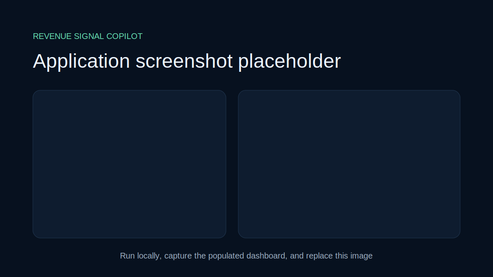
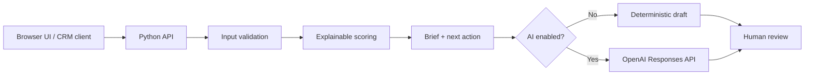

# Revenue Signal Copilot


A portfolio-ready CRM assistant for marketing and revenue teams. It transforms a lead record into an explainable priority score, account brief, next-best action, and editable outreach draft.



## Why it matters

Revenue teams often have abundant CRM data but limited time to interpret it. This demo makes prioritization consistent, shows exactly why a lead received its score, and keeps a person in control before outreach.

## Capabilities

- Accepts CRM-style JSON records through an API or included browser UI
- Scores fit and intent with visible, deterministic business rules
- Produces a concise sales brief and next-best action
- Drafts outreach in offline demo mode
- Optionally enhances the brief and draft with the OpenAI Responses API
- Never sends email or writes to a CRM automatically
- Presents a sortable synthetic CRM priority queue with pipeline metrics
- Supports lead-signal editing, score recalculation, and explainable signal visualization
- Provides editable outreach, mock CRM handoff, and a session-only human review log

## Architecture



## Quick start

Requires Python 3.11+.

```bash
python -m venv .venv
# Windows: .venv\Scripts\activate
# macOS/Linux: source .venv/bin/activate
pip install -r requirements.txt
python app.py
```

Open `http://localhost:8000`. The page loads synthetic demo data. No API key is required.

### Optional AI mode

```bash
copy .env.example .env
# Set OPENAI_API_KEY in your shell or secret manager; this app does not load .env automatically.
set OPENAI_API_KEY=your_key_here
set ENABLE_AI=true
python app.py
```

The default model is configurable through `OPENAI_MODEL`. Review current model availability for your account before changing it. AI failure falls back to deterministic output.

## API example

```bash
curl -X POST http://localhost:8000/api/analyze \
  -H "Content-Type: application/json" \
  --data @demo/lead.json
```

## Scoring model

The demo score is deliberately simple and auditable:

| Signal | Points |
|---|---:|
| Strong industry fit | +20 |
| Employee count >= 200 | +15 |
| Pricing-page visit | +20 |
| Demo requested | +25 |
| Email engagement (capped) | +0–10 |
| Recent activity <= 7 days | +10 |

This is demonstration logic, not a production prediction model. A real deployment would validate weights against outcomes, monitor bias and drift, enforce CRM permissions, and log user-approved actions.

## Safety and privacy

- Demo records are invented and clearly labeled.
- Inputs are length-limited and validated.
- AI is opt-in and disabled by default.
- External actions require human review.
- Secrets belong in environment variables or a managed secret store, never Git.

## Tests

```bash
python -m unittest discover -s tests -v
```

## Portfolio screenshots to add

1. Lead input with the synthetic record visible
2. Score and reason breakdown
3. Brief, next action, and outreach draft
4. A short GIF showing edit-before-use human review

## Roadmap

- Salesforce/HubSpot adapter interfaces with mock connectors
- CSV batch import and prioritization view
- Evaluation dataset for scoring and draft quality
- Approval logging and role-based access example

## License

MIT — see [LICENSE](LICENSE).
